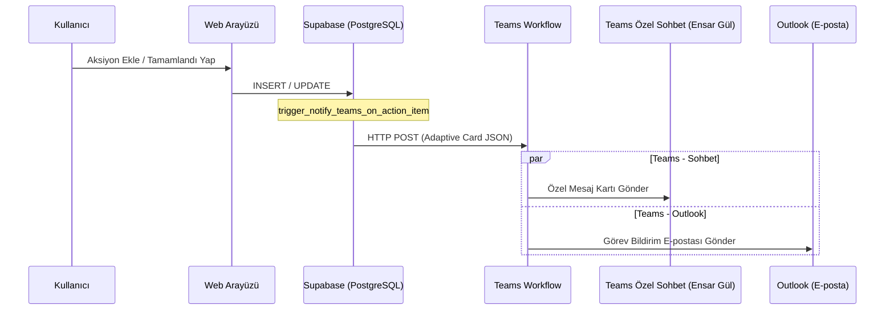

# Microsoft Teams Entegrasyonu Dokümantasyonu

Bu doküman, Aksiyon Takip Sistemi'ndeki görev değişikliklerinin Microsoft Teams ve Outlook üzerinden anlık bildirim olarak gönderilmesini sağlayan entegrasyonun detaylarını içerir.

## 1. Mimari Yapı

Entegrasyon iki ana parçadan oluşur:
1. **Microsoft Teams İş Akışı (Workflow):** Gelen HTTP POST isteklerini dinler, bunu bir Adaptive Card (Dinamik Kart) ve Outlook e-postasına dönüştürerek ilgili kişiye iletir.
2. **Supabase Tetikleyicisi (Trigger & Function):** `manuf_action_items` tablosunda yeni bir aksiyon oluşturulduğunda veya bir aksiyon tamamlandığında çalışır. Teams'in beklediği formatta Adaptive Card verisini hazırlayıp HTTP POST isteği gönderir.



---

## 2. Microsoft Teams & Akış Yapılandırması

* **Uygulama:** Teams Workflows (İş Akışları)
* **Şablon:** "Bir kanala web kancası uyarıları gönder" (Post webhook warnings to a channel)
* **Webhook Tetikleyici URL'si:**
  `https://defaultf7bf3ca5444c4640b15d4ad9a8bc7f.82.environment.api.powerplatform.com:443/powerautomate/automations/direct/workflows/8d45236face2416cb3cbd4162c44757d/triggers/manual/paths/invoke?api-version=1&sp=%2Ftriggers%2Fmanual%2Frun&sv=1.0&sig=OoR5t6WOta7PXyTH8Eb7vZB-yGGRcvHeecddHZkr3ys`

### Akış Adımları ve Ayarları:
1. **Tetikleyici (When a Teams webhook request is received):**
   * *Who can trigger the flow:* `Anyone`
2. **Kanalda veya Sohbette Kart Gönder (Post card in a chat or channel 1):**
   * *Farklı Gönder (Post as):* `Akış botu` (Flow bot)
   * *Şuraya Gönder (Post in):* `Akış botu ile sohbet edin` (Chat with Flow bot)
   * *Recipient (Alıcı):* `Ensar Gül` (Özel sohbet olarak gönderilecek kişi)
   * *Uyarlamalı Kart (Adaptive Card):* Tetikleyiciden gelen gövdeyi doğrudan alır.
3. **E-posta Gönder (Send an email V2):**
   * *Kime (To):* Gönderilecek e-posta adresi.
   * *Konu (Subject):* `Yeni Görev Ataması: [Aksiyon Başlığı]`
   * *Gövde (Body):* E-postanın içeriği.

---

## 3. Veritabanı Katmanı (SQL Kodları)

Veritabanı tarafındaki fonksiyon ve tetikleyici kodları kaynak kodlarımızda şu dosyada saklanmaktadır:
👉 [20260623160000_notify_teams_on_action_item.sql](../supabase/migrations/20260623160000_notify_teams_on_action_item.sql)

### Tetikleyici Kuralları:
* **Yeni Kayıt (INSERT):** Yeni bir görev eklendiğinde anında tetiklenir, başlıkta `📌 Yeni Aksiyon Maddesi` yazar ve sol bar yeşil (`Good`) olur.
* **Güncelleme (UPDATE):** Sadece görevin durumu **"Tamamlandı"** haline geldiğinde tetiklenir, başlıkta `✅ Aksiyon Tamamlandı!` yazar ve sol bar mavi (`Accent`) olur. Diğer güncellemeler göz ardı edilir.

---

## 4. Yerel Test Yöntemi

Yerel bilgisayarda entegrasyonu test etmek için proje kök dizininde bulunan test betiği çalıştırılabilir:
👉 [test_teams.js](../scratch/test_teams.js)

Çalıştırma komutu:
```bash
node scratch/test_teams.js
```
