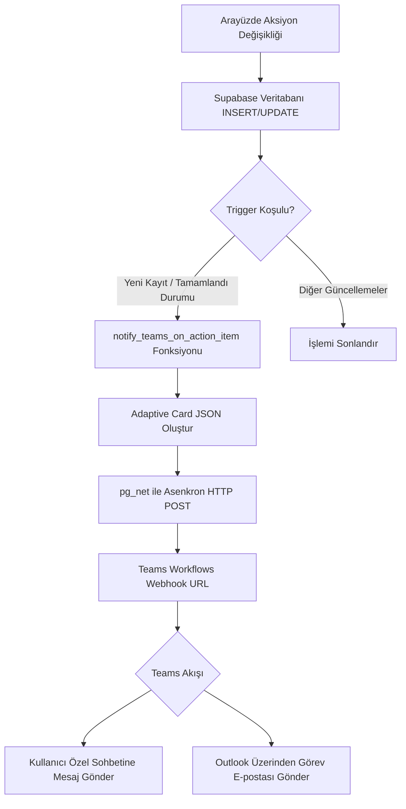

# Microsoft Teams ve E-posta Entegrasyonu

Aksiyon Takip Sistemi (`/aksiyon-takip`) üzerinde yapılan kritik görev değişikliklerinin (yeni görev ekleme ve görevin tamamlanması) Teams sohbet kanalları ve Outlook e-posta üzerinden anlık olarak bildirilmesini sağlayan sistem mimarisi.

## Sistem Mimarisi

Entegrasyon, veritabanı olaylarını (database events) yakalayıp Teams Webhook URL'sine asenkron HTTP POST istekleri atan bir PostgreSQL trigger mekanizması üzerine kurulmuştur.

---

## 1. Microsoft Teams İş Akışı (Workflow) Yapılandırması

* **Kullanılan Uygulama:** Microsoft Teams Workflows (İş Akışları)
* **Şablon:** "Bir kanala web kancası uyarıları gönder" (Post webhook warnings to a channel)
* **Tetikleyici URL'si:**
  `https://defaultf7bf3ca5444c4640b15d4ad9a8bc7f.82.environment.api.powerplatform.com:443/powerautomate/automations/direct/workflows/8d45236face2416cb3cbd4162c44757d/triggers/manual/paths/invoke?api-version=1&sp=%2Ftriggers%2Fmanual%2Frun&sv=1.0&sig=OoR5t6WOta7PXyTH8Eb7vZB-yGGRcvHeecddHZkr3ys`

### Eylem Yapılandırma Detayları:
* **Farklı Gönder (Post as):** `Akış botu` (Flow bot) - Kurumsal kısıtlamaları aşmak için kullanılır.
* **Şuraya Gönder (Post in):** `Akış botu ile sohbet edin` (Chat with Flow bot) - Doğrudan kişiye özel sohbet (DM) gönderilmesini sağlar.
* **Alıcı (Recipient):** `Ensar Gül` (Özel sohbet olarak mesajın iletileceği kişi).
* **E-posta Gönder (Send an email V2):** Outlook üzerinden `Kime` alanına girilen kişiye e-posta gönderimi yapar.

---

## 2. Veritabanı Katmanı ve Tetikleyici (Trigger) Kuralları

Tüm mantıksal süreç PostgreSQL veritabanı fonksiyonu olan `notify_teams_on_action_item()` içinde döner:

### Bildirim Koşulları:
1. **Yeni Aksiyon Eklendiğinde (INSERT):**
   * Teams kart başlığı: `📌 Yeni Aksiyon Maddesi` olur.
   * Kart sol kenarlık rengi: Yeşil (`Good`) renkli vurgu alır.
2. **Aksiyon Durumu "Tamamlandı" Yapıldığında (UPDATE):**
   * Teams kart başlığı: `✅ Aksiyon Tamamlandı!` olur.
   * Kart sol kenarlık rengi: Mavi (`Accent`) renkli vurgu alır.
3. **Diğer Güncellemeler:** Sadece isim, tarih veya açıklama değişikliklerinde Teams'i meşgul etmemek adına tetikleyici işlemi sessizce sonlandırır.

---

## İlgili Dosyalar

* [20260623160000_notify_teams_on_action_item.sql](../../supabase/migrations/20260623160000_notify_teams_on_action_item.sql) — Veritabanı tetikleyici ve fonksiyon kodu
* [teams-integration.md](../../docs/teams-integration.md) — Entegrasyonun genel teknik dokümantasyonu
* [test_teams.js](../../scratch/test_teams.js) — Yerel entegrasyon test scripti
