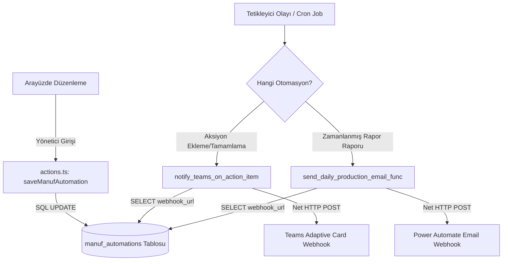

# Otomasyon & Entegrasyon Eşleştirme Paneli

Uygulamanın e-posta gönderimi ve Microsoft Teams kanalları gibi dış servislerle olan tüm bağlantılarını, zamanlanmış cron job'larını tek bir noktadan yönetmek, görselleştirmek ve açıklama notları eklemek için tasarlanmış yönetim panelidir.

## Sistem Mimarisi

Entegrasyon, veritabanı olayları ve zamanlanmış cron job'lar ile tetiklenen PostgreSQL fonksiyonlarının, hedef webhook adreslerini dinamik olarak `manuf_automations` tablosundan okuyup asenkron HTTP POST istekleri atması üzerine kurulmuştur.



---

## 1. Veritabanı Modeli (`manuf_automations`)

Tüm otomasyon eşleştirmeleri ve kullanıcı açıklamaları `manuf_automations` tablosunda saklanır:

| Kolon | Tip | Açıklama |
|-------|-----|----------|
| `id` | TEXT (PK) | Benzersiz otomasyon kimliği (Örn: `daily_report_cron`) |
| `type` | TEXT | Otomasyon tetiklenme türü: `cron` veya `trigger` |
| `name` | TEXT | Kullanıcı dostu görünür başlık |
| `schedule` | TEXT | Cron ifadesi (Sadece `cron` türü için, örn: `0 5 * * *`) |
| `source_event` | TEXT | Tetikleyici tablo ve olay bilgisi (Sadece `trigger` türü için) |
| `target_function` | TEXT | PostgreSQL üzerinde tetiklenen hedef fonksiyon adı |
| `webhook_url` | TEXT | İstek atılan dış API/Webhook adresi |
| `description` | TEXT | Kullanıcının panelden düzenleyebileceği özel not/açıklama alanı |
| `is_active` | BOOLEAN | Otomasyonun aktiflik durumu (Trigger/Cron kontrolü için) |

---

## 2. Arayüz ve Sunucu Eylemleri (Server Actions)

Panelin frontend arayüzü `/entegrasyon` rotasında yer alır.

### Sayfa Özellikleri:
* **Giriş Yetkilendirmesi:** Sayfaya doğrudan yönlendiren linkler yoktur. Kullanıcı `password_auth=rmk_hf901` yetkilendirmesi ile sayfayı açabilir.
* **Görsel İlişki Haritası:** Her otomasyon satırında `Tetikleyici ➡️ pgSQL Fonksiyonu ➡️ Webhook URL` ilişkisini gösteren CSS akış diyagramı yer alır.
* **Bağımsız Güncelleme:** Webhook adresi, cron ifadesi veya notlar her kart için ayrı olarak kaydedilir.
* **Otomatik Kurulum Tespiti:** Veritabanında `manuf_automations` tablosunun bulunup bulunmadığı kontrol edilir. Yoksa, kopyalanabilir hazır SQL göç kodu ekranda belirir.

### Sunucu Eylemleri (`actions.ts`):
* `getManufAutomations()`: Otomasyon kayıtlarını çeker.
* `saveManufAutomation(id, updates)`: webhook ve açıklamaları günceller. Eğer cron sıklığı değiştiyse `update_manuf_cron_schedule(new_schedule)` RPC'si ile `pg_cron` görevini otomatik yeniden planlar.
* `triggerCronAutomation(id)`: Zamanlama saatini beklemeden hedef e-posta fonksiyonunu manuel olarak anlık tetikler.

---

## 3. Dinamik PostgreSQL Tetikleyicileri

### Microsoft Teams Bildirimi
Aksiyon Takip Sistemi (`/aksiyon-takip`) üzerinde yeni bir madde eklendiğinde (`INSERT`) veya mevcut bir madde "Tamamlandı" durumuna geçtiğinde (`UPDATE`), `notify_teams_on_action_item()` fonksiyonu çalışır. Fonksiyon webhook adresini `manuf_automations` tablosundaki `action_item_trigger` satırından dinamik okuyarak Teams'e Adaptive Card gönderir.

### Günlük E-posta Raporu
Her sabah TRT 08:00'de (`0 5 * * *` UTC) `send_daily_production_email_func()` fonksiyonu tetiklenir. Bu fonksiyon dünün üretim adetlerini kümülatif toplayarak, `daily_report_cron` satırındaki webhook URL'ine (Power Automate) gönderim yapar.

---

---

## 4. Microsoft Planner Senkronizasyonu

Aksiyon takip sayfasındaki görevler, Teams Planner ile çift yönlü senkronize edilebilir. Senkronizasyon Power Automate akışları üzerinden çalışır.

### Akış Mimarisi

```
ManufUI → Power Automate → Planner (İleri Yön)
  - CREATE: Yeni görev + sorumlu atandığında Planner'da task oluştur
  - UPDATE: Başlık/termin/sorumlu değiştiğinde Planner task güncelle
  - COMPLETE: Durum "Tamamlandı" olduğunda Planner task'ı kapat
  - STATUS_UPDATE: Durum "Devam Ediyor" olduğunda Planner %50 yap

Planner → Power Automate → ManufUI (Ters Yön)
  - POST /api/planner-callback: Task oluşturulduktan sonra planner_task_id geri yazımı
  - POST /api/planner-sync: Planner'da tamamlanan görevlerin ManufUI'da güncellenmesi
```

### Veritabanı Alanları (`manuf_action_items`)

| Kolon | Açıklama |
|-------|----------|
| `assignee_email` | Sorumlu e-posta (manuf_assignees tablosundan) |
| `planner_task_id` | Planner'daki görev ID (callback ile geri yazılır) |

### API Endpoint'leri

| Endpoint | Metot | Açıklama |
|----------|-------|----------|
| `/api/planner-callback` | POST | Power Automate'in planner_task_id geri yazması için |
| `/api/planner-sync` | POST | Planner → ManufUI ters yön durum senkronizasyonu |

### Trigger Olay Tipleri (`event_type`)

| Tip | Tetiklenme Koşulu |
|-----|-------------------|
| `CREATE` | assignee_email atandı ve planner_task_id boş |
| `UPDATE` | title/due_date/assignee değişti ve planner_task_id dolu |
| `COMPLETE` | status → "Tamamlandı" ve planner_task_id dolu |
| `STATUS_UPDATE` | status → "Devam Ediyor" ve planner_task_id dolu |

### UI Göstergeleri

Aksiyon takip tablosunda her görevin yanında:
- **Mavi "Planner" rozeti**: Görev Planner'a senkronize (planner_task_id mevcut)
- **Gri "Bekliyor" rozeti**: Sorumlu atanmış ama Planner görevi henüz oluşturulmamış
- Sorumlu atanmamış görevlerde rozet gösterilmez

---

## İlgili Dosyalar

* [20260624110000_integration_settings.sql](../../supabase/migrations/20260624110000_integration_settings.sql) — Otomasyon DDL göç kodu
* [20260628160000_complete_planner_sync.sql](../../supabase/migrations/20260628160000_complete_planner_sync.sql) — Planner senkronizasyon trigger güncellemesi
* [src/app/api/planner-callback/route.ts](../../src/app/api/planner-callback/route.ts) — Planner task ID callback endpoint
* [src/app/api/planner-sync/route.ts](../../src/app/api/planner-sync/route.ts) — Ters yön durum senkronizasyonu endpoint
* [src/app/entegrasyon/page.tsx](../../src/app/entegrasyon/page.tsx) — Panel arayüz dosyası
* [src/app/actions.ts](../../src/app/actions.ts) — Sunucu eylemleri
